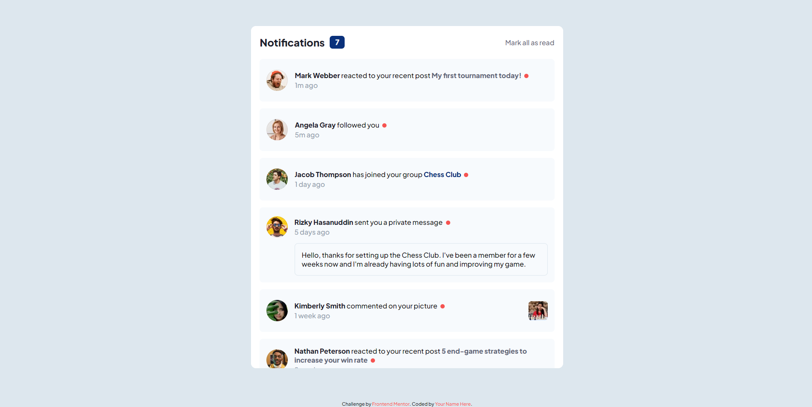

# Frontend Mentor - Notifications page solution

Esta es mi propuesta de solucion al reto [Notifications page challenge on Frontend Mentor]

## Tabla de contenidos

- [Descripcion](#descripcion)
  - [El desafio](#el-desafio)
  - [Screenshot](#screenshot)
  - [Links](#links)
- [Mi proceso](#mi-proceso)
  - [Hecho con](#hecho-con)
  - [Lo aprendido](#lo-que-aprendi)
  - [Aprendiendo](#aprendiendo)
- [Autor](#autor)

## Descripcion

Panel de notificaciones interactivo, permite marcar como leido o no leido o todos a la vez.

## El desafio

El usuario deberia poder

- Distinguir entre notificaciones "leidas" y "no-leidas" 
- seleccionar "Mark all as read" para cambiar el estado visual de las notificaciones a leidas y cambiar el numero de notificaciones no-leidas a cero.
- Ver el layout optimo dependiendo de su tamano de pantalla.
- Ver la interaccion cuando se coloca el mouse encima de los elementos.

## Screenshot

## Links

- Solucion: [GITHUB](https://github.com/J-HernandezM/notifications)
- Live site: [PAGES](https://j-hernandezm.github.io/notifications/)

## Mi proceso

Para este ejercicio lo que mas se me complico fueron los estilos CSS, en general el layout, colores y demas se me hace sencillo, pero lo que se me complica mas es la interaccion entre los diferentes componentes, que no se salgan de sus contenedores, que no se superpongan, etc.

En cuanto al JavaScript me senti mas habil en ese aspecto, pienso que lo logre solucionar en un mejor tiempo y sin mayores complicaciones.

## Hecho con

- Semantic HTML5 markup
- CSS custom properties
- Flexbox
- CSS Grid
- Mobile-first workflow
- simple JavaScript

## Lo que aprendi

Configurar un contenedor grid para que sus elementos no se salgan, que tenga altura variable, que sus elementos tengan un tamano dependiendo del contenido.

Aprendi que al anadir un eventListener puedo dar click a todos sus elementos hijos y referirme a ellos tambien como elemento seleccionado, antes pensaba que esto solo lo podia hacer con el elemento padre.

Aprendi tambien la diferencia entre auto-fill y auto-fit, asi como el uso de la propiedad grid-auto-rows

## Aprendiendo
Me gustaria mejorar mi habilidad para hacer layouts, sobretodo la parte de CSS es la que mas se me esta complicando

Me gustaria en los siguientes proyectos seguir aplicando JavaScript asi sea basico para no olvidar las cositas que he aprendido.

En este proyecto quisiera anadir las notificaciones de manera dinamica desde el JavaScript como si estas provinieran desde una API, es un feature que hare luego

## Autor

- Website - [Portfolio en construccion](https://j-hernandezm.github.io)
- Frontend Mentor - [@J-HernandezM](https://www.frontendmentor.io/profile/J-HernandezM)
- Github - [@J-HernandezM](https://github.com/J-HernandezM)
- Twitter - [@__HernandezM](https://www.twitter.com/__HernandezM)
